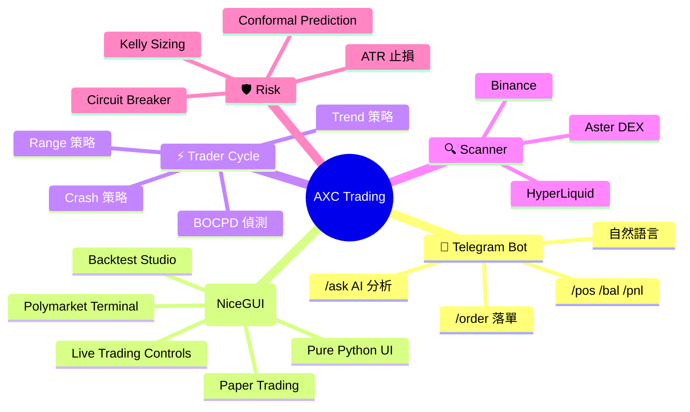
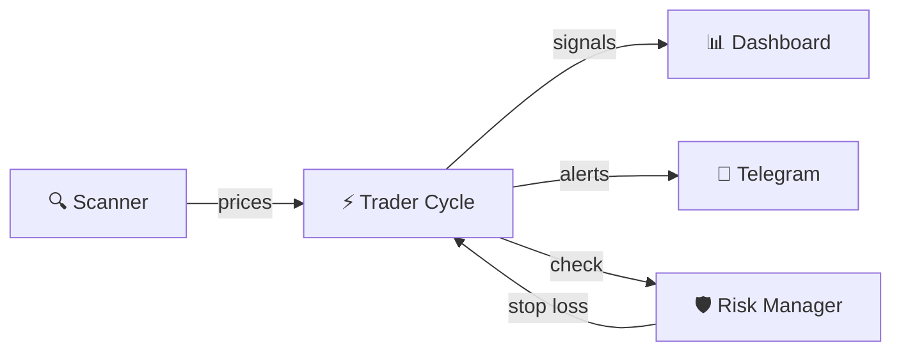
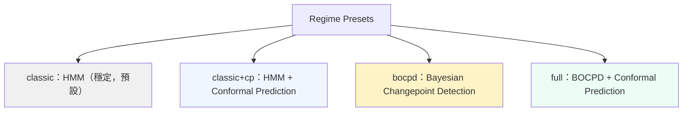
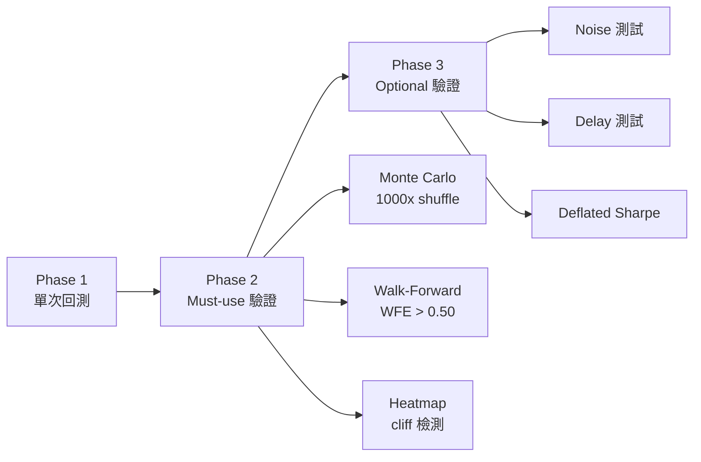
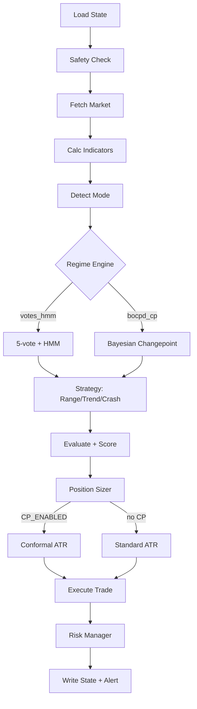

<p align="center">
  <h1 align="center">AXC Trading System</h1>
  <p align="center">
    AXC 就好似你請咗一個 24 小時唔使瞓嘅交易助理。<br />
    佢住喺你部電腦入面，幫你睇住市場、計好風險、有機會就提你。<br />
    你嘅密碼同錢永遠都只喺你部機。
    <br /><br />
    <code>v3.0</code> · 2026-03
    <br /><br />
    <a href="#-快速開始"><strong>快速開始 »</strong></a>
    &nbsp;&nbsp;·&nbsp;&nbsp;
    <a href="#-功能一覽"><strong>功能 »</strong></a>
    &nbsp;&nbsp;·&nbsp;&nbsp;
    <a href="#-常見問題"><strong>FAQ »</strong></a>
  </p>
</p>

---

> **Part 1** 係寫畀人睇嘅（廣東話，簡單直接）。
> **[Part 2](#part-2--llm-structured-reference)** 係寫畀 LLM / 開發者睇嘅（結構化參考）。

---

# Part 1 · 人睇

## 點解用 AXC？

🔒 **你嘅嘢永遠喺你度** — API key、交易記錄、AI 分析全部本地跑，冇嘢上雲
🤖 **唔使盯盤** — 自動掃描 3 交易所、偵測 regime、幫你落單止損
🧠 **愈用愈聰明** — RAG 記憶系統記住每一筆交易，AI 分析會參考你嘅歷史

---

## 🗺 系統全景



---

## 🧠 系統流程



Scanner 不斷掃描市場 → Trader Cycle 用策略分析 → 有信號就通知你 + 自動管理風險。

---

## 兩種用法

| 模式 | 適合 | 包含 |
|------|------|------|
| **🤖 AXC Standalone** | 想用 Telegram Bot 查倉落單 | Telegram Bot + AI 分析 + 落單 |
| **🦞 Full AXC** | 想要自動交易 + Dashboard | 以上全部 + Trader Cycle + Dashboard + 自動掃描 |

> 大部分朋友用 **AXC Standalone** 就夠。以下指南以 AXC 為主。

---

## ✨ 功能一覽

### 查詢（零 AI 成本，直接讀交易所）

| Command | 功能 |
|---------|------|
| `/pos` | 查持倉（入場價、標記價、未實現盈虧） |
| `/bal` | USDT 餘額 + 今日盈虧 |
| `/pnl` | 已實現盈虧、資金費、手續費 |
| `/report` | 完整交易報告（一次睇晒） |
| `/sl` | 查止損單 |
| `/sl breakeven` | 移動止損到入場價（保本） |
| `/health` | 系統狀態檢查 |

### 落單

| Command | 功能 |
|---------|------|
| `/order` | 互動式落單精靈（按鈕引導：交易所→幣種→方向→倉位）|
| `/trade <交易所> <幣種> <方向> [金額]` | 快速落單（例：`/trade aster BTC LONG 50`） |
| `/close [交易所] <幣種>` | 平倉 |
| 自然語言 | 「做多 ETH $50」→ 確認 → 自動落單 |

> `/order` 輸入 `金額,槓桿`（例：`5,5` = $5 · 5x）自動計名義。所有落單都有二次確認。

### AI 分析（需要 `PROXY_API_KEY`）

| Command | 功能 |
|---------|------|
| `/ask <問題>` | AI 分析市場（結合你嘅持倉 + RAG 記憶） |
| 自動推送 | 倉位平倉時自動生成 AI 報告 + 教練評語 |

### 自然語言落單示例

```
做多 ETH $50          →  ETHUSDT LONG $50
做空 BTC $100 SL 2%   →  BTCUSDT SHORT $100, 止損 2%
平倉 ETH              →  關閉 ETHUSDT 持倉
all in ETH             →  全倉做多 ETHUSDT
```

> 所有落單都有二次確認，唔會直接執行。高風險訂單（≥80% 餘額）有額外警告。

---

## 🚀 快速開始

### 1. 下載

```bash
# Clone（推薦，方便更新）
git clone https://github.com/Will-852/AXC-TradingBot.git
cd AXC-TradingBot
```

### 2. 安裝 Python

| 平台 | 安裝方法 |
|------|----------|
| macOS | `brew install python3` |
| Windows | [python.org/downloads](https://python.org/downloads/) → **勾選 "Add to PATH"** |
| Linux | `sudo apt install python3 python3-pip` |

確認版本（需要 **3.9+**）：`python3 --version`

### 3. 安裝依賴

```bash
pip install -r axc_requirements.txt
```

> Windows 用 `pip` 唔係 `pip3`。搵唔到 `pip` → `python -m pip install -r axc_requirements.txt`

### 4. 設定 API Keys

```bash
mkdir -p secrets
cp .env.example secrets/.env
# 用任何文字編輯器打開 secrets/.env，填入你嘅 keys
```

> 唔知點攞呢啲 key？ → [詳細教學](#-設定-api-keys)

### 5. 啟動

```bash
# macOS / Linux
AXC_HOME=$(pwd) python3 scripts/tg_bot.py
```

```cmd
:: Windows CMD
set AXC_HOME=%cd%
python scripts\tg_bot.py
```

啟動成功你會見到：
```
🦞 AXC v2.5 啟動
  Chat ID: 你嘅chat_id
```

去 Telegram 同你嘅 Bot 講 **`/start`** 🎉

---

## 📊 Dashboard (NiceGUI v3)

> v3.0 新增：Pure Python UI，取代舊 HTML dashboard。直接控制交易，冇中間 API 層。

### 啟動

```bash
cd ~/projects/axc-trading
python3 scripts/dashboard_ng/main.py
# → http://127.0.0.1:5567
```

### 功能

| 頁面 | 功能 |
|------|------|
| **主控台** `/` | KPI stats、持倉管理、落單、行動部署、PnL 圖表、新聞、風控 |
| **回測** `/backtest` | KLineChart + 12 自定指標 + Live WebSocket + Drawing |
| **Polymarket** `/polymarket` | Live wallet、策略參數 sliders、pipeline 控制、PID 監控 |
| **Paper Trading** `/paper` | Dry-run 啟動/停止 + 交易記錄 |
| **文件** `/docs` | Markdown 文件瀏覽器 |

### 主要操作

- **Click 行動部署表嘅 row** → 落單（5 步：margin mode → leverage → entry → SL → TP）
- **OB 按鈕** → 訂單簿深度
- **Profile / Regime / Trading** → 直接切換
- **Exchange Connect** → 連接/斷開交易所
- **Notification Bell** → 24 小時告警歷史
- **R 鍵** → 強制刷新

### 遠端存取

```bash
# 同一 WiFi
# main.py: ui.run(host='0.0.0.0', ...)
# 然後開 http://<Mac IP>:5567

# 任何地方
brew install cloudflared
cloudflared tunnel --url http://127.0.0.1:5567
```

> 完整指南：[`docs/guides/03-dashboard-guide.md`](docs/guides/03-dashboard-guide.md)

---

## 🔑 設定 API Keys

### Telegram Bot Token

> ⚠️ 每位用家必須建立自己嘅 Bot，唔可以共用 Token。兩人用同一個 Token 會出 409 Conflict 錯誤。

1. 打開 Telegram，搵 **[@BotFather](https://t.me/BotFather)**
2. Send `/newbot`
3. 改個名（例如 `My Trading Bot`）
4. 改個 username（例如 `my_trading_123_bot`，必須以 `bot` 結尾）
5. BotFather 會回覆一個 **token**（格式：`123456789:ABC-DEFghijklmnop...`）
6. 複製貼到 `.env` 嘅 `TELEGRAM_BOT_TOKEN=`

### Telegram Chat ID

1. 打開 Telegram，搵 **[@userinfobot](https://t.me/userinfobot)**
2. Send `/start`
3. 佢會回覆你嘅 **ID**（一串數字，例如 `123456789`）
4. 複製貼到 `.env` 嘅 `TELEGRAM_CHAT_ID=`

> 🔒 **安全**：Bot 只會回應呢個 Chat ID，其他人嘅訊息會被靜默忽略。

### Aster DEX API Keys

1. 去 **[asterdex.com](https://asterdex.com)** → 登入（或註冊）
2. **Settings** → **API Management** → **Create API Key**
3. 權限設定：**開啟 Futures Trading**
4. 複製 **API Key** → 貼到 `.env` 嘅 `ASTER_API_KEY=`
5. 複製 **Secret Key** → 貼到 `.env` 嘅 `ASTER_API_SECRET=`

> ⚠️ **安全提示**：唔好開「提幣」權限。API key 淨係需要 Futures Trading 就夠。

### Claude API Key（選填，AI 功能用）

冇呢個 key，`/ask` 同自然語言落單唔會用到，但所有查詢指令（`/pos` `/bal` `/pnl`）照常運作。

```env
PROXY_API_KEY=你嘅key
PROXY_BASE_URL=https://api.anthropic.com
```

---

## 🖥 啟動

### macOS / Linux

```bash
AXC_HOME=$(pwd) python3 scripts/tg_bot.py
```

### Windows — CMD

```cmd
set AXC_HOME=%cd%
python scripts\tg_bot.py
```

### Windows — PowerShell

```powershell
$env:AXC_HOME = (Get-Location).Path
python scripts\tg_bot.py
```

### 後台運行（macOS / Linux）

```bash
mkdir -p logs
AXC_HOME=$(pwd) nohup python3 scripts/tg_bot.py > logs/tg_bot.log 2>&1 &
```

查看 log：`tail -f logs/tg_bot.log` · 停止：`pkill -f tg_bot.py`

---

## 📘 使用指南

### 查持倉

Send `/pos` 到你嘅 Bot：
```
📊 POSITIONS · 2026-03-08 15:30 UTC+8

ETHUSDT LONG  50.0 USDT
  Entry  $2,150.00  Mark $2,180.00
  PnL    +$12.50 (+1.4%)
  SL     $2,100.00
```

### 互動式落單（推薦）

Send `/order`，按鈕引導你完成落單：
```
/order
  → Step 1: 揀交易所 [Aster] [Binance] [HL]
  → Step 2: 揀幣種（按交易所過濾）
  → Step 3: 揀方向 [🟢 LONG] [🔴 SHORT]
  → Step 4: 輸入「金額,槓桿」
     例：5,5 = $5 · 5x · 名義 ~$25
  → 確認頁（顯示 SL/TP 預覽）
```

每步有 ❌ 取消按鈕，60 秒無操作自動過期。名義值最少 $5。

### 自然語言落單

直接打字（唔使 `/` 開頭）：`做多 ETH $50`

Bot 會顯示確認 → 撳 ✅ 先會真正落單。60 秒後自動取消。

**支援嘅講法：**
- `做多 ETH $50` / `long ETH 50u`
- `做空 BTC $100` / `short BTC 100u`
- `平倉 ETH` / `close ETH`
- `做多 ETH $50 SL 2%` — 自訂止損
- `all in ETH` — 全倉做多

### AI 分析

```
/ask BTC 短期走勢如何？
```

Bot 會結合你嘅持倉、歷史交易記錄（RAG 記憶）同實時價格生成分析。

---

## ❓ 常見問題

<details>
<summary><b>Bot 冇反應 / Telegram 報 409 Conflict</b></summary>

**原因**：有多個 Bot instance 同時運行，爭住讀 Telegram 更新。

**解決**：
```bash
pkill -f tg_bot.py
# 等幾秒再重新啟動
AXC_HOME=$(pwd) python3 scripts/tg_bot.py
```

Windows：`taskkill /F /IM python.exe`
</details>

<details>
<summary><b>pip install 失敗 / ImportError: No module named 'telegram'</b></summary>

```bash
python3 -m pip install -r axc_requirements.txt
# 權限問題：加 --user
python3 -m pip install --user -r axc_requirements.txt
```

Windows 用 `python` 唔係 `python3`。
</details>

<details>
<summary><b>ASTER_API_KEY/ASTER_API_SECRET missing</b></summary>

```bash
ls secrets/.env        # 確認 .env 存在
cp .env.example secrets/.env  # 如果唔存在
nano secrets/.env      # 打開編輯
```
</details>

<details>
<summary><b>/ask 回覆好慢（>10 秒）</b></summary>

- 問短啲嘅問題
- 用 `/forget` 清除對話記憶
- 確認 `PROXY_BASE_URL` 正確
- 檢查網絡連接
</details>

<details>
<summary><b>/mode 或 /pause 顯示「需要 AXC 環境」</b></summary>

呢啲指令需要完整 AXC 系統（有 `config/params.py`）。Standalone 模式唔支援，但**唔影響**查詢同落單功能。
</details>

<details>
<summary><b>Windows 啟動失敗</b></summary>

1. `python --version` → 需要 3.9+
2. 安裝時有冇勾選 **Add to PATH**？
3. 用 `python` 唔係 `python3`
4. PowerShell：`Set-ExecutionPolicy -Scope CurrentUser RemoteSigned`
5. 路徑用 `\` 唔係 `/`
</details>

<details>
<summary><b>點樣更新到最新版？</b></summary>

```bash
cd ~/projects/axc-trading
git pull origin main
pip install -r axc_requirements.txt
```

你嘅 `secrets/.env` 同 `config/user_params.py` **唔會被覆蓋**。

如有衝突：
```bash
git stash && git pull && git stash pop
```

> 自訂參數應該放 `config/user_params.py`（gitignored），唔好改 `config/params.py`。
</details>

<details>
<summary><b>安全嗎？會唔會洩露我嘅 API key？</b></summary>

- API keys 只存喺你本地嘅 `secrets/.env`（已 gitignore）
- Bot 唔會將 key 發送去任何第三方
- 交易所 API key 建議只開 **Futures Trading** 權限，唔好開提幣
</details>

---

## 💰 成本

| 操作 | 成本 |
|------|------|
| `/pos` `/bal` `/pnl` `/report` `/sl` `/health` | 免費 |
| `/ask`（短問題） | ~$0.001 |
| 自然語言落單 | ~$0.001 |
| 自動平倉報告 | ~$0.002 |
| **每日活躍使用估算** | **~$0.02/日** |

> 冇設定 `PROXY_API_KEY` 嘅話，所有 AI 功能唔會產生費用，查詢功能照常免費使用。

---

## 🆕 最新功能（v2.5）

### Regime Engine — 4 種引擎組合

市場唔會永遠一樣行。Regime Engine 幫你自動判斷而家係咩狀態（Range / Trend / Crash），揀唔同嘅偵測方式：



- **classic** — 用 HMM + 5 票制，最穩定
- **classic+cp** — 加埋 Conformal Prediction 調節止損寬度
- **bocpd** — Bayesian 方法偵測 regime 轉換點，反應更快
- **full** — BOCPD + CP，最保守嘅風控

> Dashboard 可以一鍵切換 preset。Regime 同 Risk Profile 係正交嘅（N profiles × 4 presets）。

### Paper Trading — 模擬交易

想試下策略但唔想落真金？Dashboard 有 Paper Trading 模式：
- 一鍵啟動 dry-run（同真嘅 Trader Cycle 一樣邏輯，但唔會真正落單）
- 所有模擬交易記錄喺 `shared/TRADE_LOG.md`（`[DRY_RUN]` 標記）
- 同 live trading 互斥 — 跑緊 live 就開唔到 paper，反之亦然

### Backtest 系統 — 6 項驗證

回測唔係跑一次就算。AXC 有 3 階段驗證：



全部 PASS 先改 `params.py`，唔係靠感覺。

### Service Management — Dashboard 管理面板

Dashboard sidebar 可以一鍵管理 8 個 macOS LaunchAgent 服務：
Scanner / Trader / Telegram / Dashboard / Heartbeat / LightScan / NewsBot / Report

### Crash Strategy — 跌市專用

新增 SHORT-only 策略，專門應對 Crash regime。2-of-3 gate（RSI + MACD + Volume），風控更保守（1% risk, 5x leverage）。

---

## 📋 環境變數

| 變數 | 必填 | 用途 |
|------|------|------|
| `TELEGRAM_BOT_TOKEN` | ✅ | Telegram Bot Token（[@BotFather](https://t.me/BotFather)） |
| `TELEGRAM_CHAT_ID` | ✅ | 你嘅 Chat ID（白名單，其他人用唔到） |
| `ASTER_API_KEY` | ✅ | Aster DEX API Key |
| `ASTER_API_SECRET` | ✅ | Aster DEX API Secret |
| `PROXY_API_KEY` | 選填 | Claude API Key（`/ask` + 自然語言落單） |
| `PROXY_BASE_URL` | 選填 | API endpoint（預設 `https://tao.plus7.plus/v1`） |
| `VOYAGE_API_KEY` | 選填 | Voyage AI embedding（RAG 記憶增強，冇就用 hash fallback） |

---

# Part 2 · LLM Structured Reference

> 以下係寫畀 AI agent 同開發者嘅結構化參考。

---

## 🏗 Architecture

### Trader Cycle Pipeline（16+ 步）



**兩層掃描系統：**
- **Layer 1**: `async_scanner.py`（常駐 daemon）— 9 exchanges × 20s = 180s full rotation
- **Layer 2**: `light_scan.py`（3 min cron）— Aster only, 4 triggers: PRICE / VOLUME / SR_ZONE / FUNDING

**4 Regime Presets（§12 of params.py）：**

| Preset | REGIME_ENGINE | CP_ENABLED | 描述 |
|--------|---------------|------------|------|
| `classic` | `votes_hmm` | False | HMM + 5 票制（預設） |
| `classic_cp` | `votes_hmm` | True | HMM + Conformal ATR |
| `bocpd` | `bocpd_cp` | False | Bayesian Changepoint |
| `full` | `bocpd_cp` | True | BOCPD + Conformal ATR |

---

## 📂 Complete File Tree

```
axc-trading/
├── scripts/                          # 所有可執行程式
│   ├── tg_bot.py                     #   Telegram Bot
│   ├── dashboard.py                  #   Web Dashboard（port 5566）
│   ├── async_scanner.py              #   9 交易所掃描器（Layer 1）
│   ├── light_scan.py                 #   Aster 輕量掃描（Layer 2）
│   ├── indicator_calc.py             #   技術指標計算（25+ indicators）
│   ├── public_feeds.py               #   9 exchange API adapters
│   ├── heartbeat.py                  #   15 min 健康檢查
│   ├── news_scraper.py               #   RSS 新聞收集
│   ├── news_sentiment.py             #   Haiku 情緒分析
│   ├── weekly_strategy_review.py     #   每週回顧 → ai/STRATEGY.md
│   ├── slash_cmd.py                  #   14 slash commands（零 AI）
│   ├── load_env.sh                   #   LaunchAgent .env wrapper
│   ├── backup_agent.sh               #   git + push + zip backup
│   ├── health_check.sh               #   7 類別系統診斷
│   └── trader_cycle/                 #   ⭐ 自動交易引擎
│       ├── main.py                   #     入口（--live / --dry-run）
│       ├── core/                     #     pipeline.py, context.py, registry.py
│       ├── strategies/               #     Range + Trend + Crash + Regime（HMM/BOCPD）
│       │   ├── range_strategy.py     #       BB/RSI/STOCH entry
│       │   ├── trend_strategy.py     #       EMA cross/RSI/ADX entry
│       │   ├── crash_strategy.py     #       SHORT-only, 2-of-3 gate
│       │   ├── mode_detector.py      #       5 票制 mode detection
│       │   ├── regime_hmm.py         #       Hidden Markov Model
│       │   ├── regime_bocpd.py       #       Bayesian Changepoint Detection
│       │   └── evaluate.py           #       信號評分 + 排名
│       ├── exchange/                 #     Aster / Binance / HyperLiquid
│       │   ├── market_data.py        #       自動路由 API
│       │   ├── aster_client.py       #       Aster DEX
│       │   ├── execute_trade.py      #       7-step order sequence
│       │   └── position_sync.py      #       持倉同步
│       ├── risk/                     #     風控 + 倉位
│       │   ├── risk_manager.py       #       移動止損 / TP 延伸
│       │   ├── position_sizer.py     #       ATR-based + Kelly sizing
│       │   ├── atr_conformal.py      #       Conformal Prediction ATR
│       │   ├── adjust_positions.py   #       trailing SL / early exit
│       │   └── validators.py         #       pre-trade checks
│       ├── state/                    #     狀態管理
│       ├── notify/                   #     Telegram alerts
│       └── config/                   #     pairs.py (7) + settings.py
├── backtest/                         # 回測系統
│   ├── engine.py                     #   Candle-by-candle 模擬器（MTF, signal_delay）
│   ├── validate.py                   #   6 驗證工具（3 must-use + 3 optional）
│   ├── grid_search.py                #   參數優化（ProcessPoolExecutor）
│   ├── optimizer.py                  #   LHS 優化器
│   ├── run_backtest.py               #   單 pair CLI 入口
│   ├── metrics_ext.py                #   擴展指標
│   ├── compare_configs.py            #   A/B configs 對比
│   └── strategies/                   #   回測專用策略
├── config/
│   ├── params.py                     #   14 sections 共用參數
│   ├── user_params.py                #   你嘅 override（gitignored）
│   ├── modes/                        #   RANGE / TREND / VOLATILE
│   └── profiles/                     #   conservative / balanced / aggressive
├── agents/                           # AI Agents（各有 SOUL.md）
├── memory/                           # RAG 記憶系統（jsonl + npy）
├── shared/                           # 運行時狀態（TRADE_STATE、prices_cache.json）
├── secrets/.env                      # API keys（gitignored）
├── docs/                             # 文檔 + 分析
├── canvas/                           # Dashboard 前端 HTML + SVG
├── logs/                             # 日誌
└── backups/                          # auto zip（keep 10）
```

---

## ⚙️ Config Reference

### params.py（14 sections）

| § | Section | 關鍵參數 |
|---|---------|---------|
| 1 | 掃描設定 | EXCHANGE_ROTATION, SCAN_INTERVAL |
| 2 | BB 指標 | BB_PERIOD, BB_STD |
| 3 | 指標時間框 | TIMEFRAME_PARAMS, MACD, Stoch, OBV, SR |
| 4 | Trend 策略 | EMA_FAST, EMA_SLOW, ADX_THRESHOLD |
| 5 | 模式偵測 | MODE_DETECTION thresholds |
| 6 | 倉位管理 | MAX_POSITION_SIZE_USDT |
| 7 | Profile 設定 | ACTIVE_PROFILE, AUTO_PROFILE_SWITCH |
| 8 | 幣種 + 引擎 | ASTER_SYMBOLS, BINANCE_SYMBOLS, HL_SYMBOLS |
| 9 | 新聞/情緒 | NEWS_SENTIMENT config |
| 10 | HMM Regime | HMM parameters |
| 11 | Crash Strategy | CRASH_RISK_PCT=0.01, CRASH_LEVERAGE=5 |
| 12 | **Regime Engine** | **REGIME_PRESETS, ACTIVE_REGIME_PRESET** |
| 13 | BOCPD | hazard_rate=0.02, max_run_length=200 |
| 14 | Conformal Prediction | CP_ALPHA=0.10, CP_MIN/MAX_SCORES |

### 環境變數

見 [環境變數](#-環境變數) section。

### REGIME_PRESETS 用法

```python
# config/params.py §12
REGIME_PRESETS = {
    "classic":    {"REGIME_ENGINE": "votes_hmm", "CP_ENABLED": False},
    "classic_cp": {"REGIME_ENGINE": "votes_hmm", "CP_ENABLED": True},
    "bocpd":      {"REGIME_ENGINE": "bocpd_cp",  "CP_ENABLED": False},
    "full":       {"REGIME_ENGINE": "bocpd_cp",  "CP_ENABLED": True},
}
ACTIVE_REGIME_PRESET = "classic"
```

Dashboard dropdown 切換。Preset 同 Profile 正交（N × M 組合）。

---

## 🔌 Dashboard API Endpoints

### GET

| Endpoint | 用途 |
|----------|------|
| `/api/data` | 主 dashboard 數據 |
| `/api/state` | trade state + signal + key params |
| `/api/config` | 所有交易參數 |
| `/api/health` | agent status + timestamps + heartbeat |
| `/api/scan-log` | last 20 scan log lines |
| `/api/suggest_mode` | profile suggestion（BTC 24h change） |
| `/api/exchange/balance` | 所有交易所餘額（parallel） |
| `/api/exchange/symbol-info` | precision rules for trade modal |
| `/api/binance/status` | Binance 連接狀態 |
| `/api/aster/status` | Aster 連接狀態 |
| `/api/hl/status` | HyperLiquid 連接狀態 |
| `/api/backtest/list` | 回測 JSONL metadata |
| `/api/backtest/results` | 回測交易結果 |
| `/api/backtest/status` | 回測 job 狀態 |
| `/api/paper-trading` | dry-run 狀態 + 紀錄 |
| `/api/services` | 8 個 LaunchAgent 服務狀態 |

### POST

| Endpoint | 用途 |
|----------|------|
| `/api/set_mode` | 切換 trading profile |
| `/api/set_regime` | 切換 regime preset |
| `/api/config/trading` | 開關 TRADING_ENABLED |
| `/api/place-order` | 開倉（from trade modal） |
| `/api/close-position` | 市價平倉 |
| `/api/modify-sltp` | 改 SL/TP |
| `/api/cancel-order` | 取消掛單 |
| `/api/backtest/run` | 啟動回測 |
| `/api/paper-trading/start` | 啟動 dry-run |
| `/api/paper-trading/stop` | 停止 dry-run |
| `/api/service/restart` | 重啟 LaunchAgent 服務 |
| `/api/chat` | AI 對話（haiku/sonnet） |
| `/api/{exchange}/connect` | 儲存交易所 credentials |
| `/api/{exchange}/disconnect` | 移除交易所 credentials |

---

## 🤖 Model Tiers

| Tier | Model | 用途 | 成本 |
|------|-------|------|------|
| tier1 | claude-sonnet-4-6 | 決策 + 交易分析 | $$$ |
| tier2 | claude-haiku-4-5 | 掃描 + tg_bot + 新聞 | $ |
| tier3 | gpt-5-mini | 日常 / agent default | $ |
| Python | — | scanner, trader_cycle, heartbeat | 零 AI cost |

Proxy: `https://tao.plus7.plus/v1`（PROXY_API_KEY）

---

## 📊 Trading Pairs

| Pair | Aster | Binance | HL | Group | Priority |
|------|-------|---------|----|-------|----------|
| BTCUSDT | ✅ | ✅ | ✅ | crypto_correlated | 4 |
| ETHUSDT | ✅ | ✅ | ✅ | crypto_correlated | 3 |
| SOLUSDT | - | ✅ | ✅ | crypto_correlated | 3 |
| XRPUSDT | ✅ | - | - | crypto_independent | 2 |
| POLUSDT | - | ✅ | - | crypto_independent | 2 |
| XAGUSDT | ✅ | - | - | commodity | 1 |
| XAUUSDT | ✅ | - | - | commodity | 1 |

每組 max 1 倉，最多 3 倉同時。`market_data.py` 自動路由 API。

---

## 🤝 共同開發指南

> 如果你用 LLM（ChatGPT / Claude / Cursor）輔助開發，將呢個 section 貼畀佢就夠。

### 環境設定（一次性）

```bash
git clone https://github.com/Will-852/AXC-TradingBot.git ~/projects/axc-trading
cd ~/projects/axc-trading
pip3 install -r requirements.txt
mkdir -p secrets
cp docs/friends/.env.example secrets/.env
# 填入你嘅 API keys
```

### 檔案修改規則

```
✅ 可以改（你嘅本地檔案，gitignored）
  secrets/.env              ← 你嘅 API keys
  config/user_params.py     ← 你嘅交易參數 override

⚠️ 唔好直接改（會被 git pull 覆蓋）
  config/params.py          ← 共用預設值，改 user_params.py 代替
  scripts/*.py              ← 共用邏輯，有需要開 issue 討論

📖 唯讀參考
  docs/                     ← 文檔
  ai/                       ← AI agents 上下文
  agents/*/SOUL.md          ← Agent 人格定義
```

### 提交新方案（PR 流程）

```bash
git checkout main && git pull
git checkout -b friend-new-approach
# 做嘢、測試、commit
git add <改咗嘅文件>
git commit -m "feat: 你嘅改動描述"
git push -u origin friend-new-approach
gh pr create --title "你嘅標題" --body "改咗咩 + 點解"
```

**注意：** 唔好直接 push 去 `main`。一個 PR 做一件事。改策略附上 backtest 結果會加快 review。

---

## 🛠 Tech Stack

| 層面 | 技術 |
|------|------|
| 語言 | Python 3.9+ |
| AI 推理 | Claude API（Sonnet / Haiku / GPT-5-mini） |
| 向量嵌入 | Voyage AI（voyage-3） |
| 記憶儲存 | jsonl + numpy（唔用資料庫） |
| 交易所 | Aster DEX / Binance Futures / HyperLiquid |
| Regime 偵測 | HMM + BOCPD（Bayesian Changepoint） |
| 風控 | Conformal Prediction ATR + Kelly Sizing |
| 回測驗證 | Monte Carlo / Walk-Forward / Heatmap / DSR |
| 介面 | Telegram Bot + Web Dashboard（:5566） |
| 排程 | macOS LaunchAgents |

---

## License

MIT

---

<p align="center">
  Made with 🦞 by <a href="https://github.com/Will-852">@Will-852</a>
  <br />
  <sub>Architecture, code & docs co-developed with <a href="https://claude.ai">Claude</a> (Anthropic)</sub>
</p>
