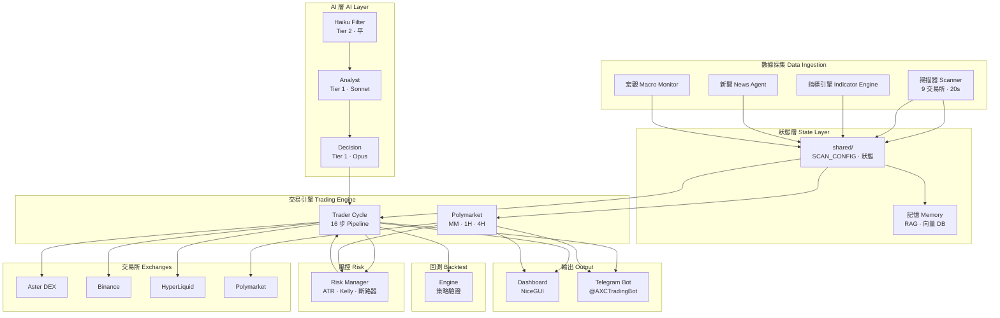

<!-- NOTE: 此 Mermaid 源碼係 Draw.io 嘅草稿版本。
     正式 SVG 由 Draw.io 手動排版生成（1-system-overview.drawio）。
     改呢個文件唔會自動更新 SVG — 要用 open_drawio_mermaid 重新匯入。 -->

```mermaid
graph TD
    subgraph data["數據採集 Data Ingestion"]
        SC["掃描器 Scanner\n9 交易所 · 20s"]
        IF["指標引擎 Indicator Engine"]
        NW["新聞 News Agent"]
        MC["宏觀 Macro Monitor"]
    end

    subgraph state["狀態層 State Layer"]
        SH["shared/\nSCAN_CONFIG · 狀態"]
        MEM["記憶 Memory\nRAG · 向量 DB"]
    end

    subgraph engine["交易引擎 Trading Engine"]
        TC["Trader Cycle\n16 步 Pipeline"]
        PM["Polymarket\nMM · 1H · 4H"]
    end

    subgraph ai["AI 層 AI Layer"]
        HK["Haiku Filter\nTier 2 · 平"]
        SN["Analyst\nTier 1 · Sonnet"]
        OP["Decision\nTier 1 · Opus"]
    end

    subgraph exchanges["交易所 Exchanges"]
        AS["Aster DEX"]
        BN["Binance"]
        HL["HyperLiquid"]
        PY["Polymarket"]
    end

    subgraph output["輸出 Output"]
        DB["Dashboard\nNiceGUI"]
        TG["Telegram Bot\n@AXCTradingBot"]
    end

    subgraph risk["風控 Risk"]
        RM["Risk Manager\nATR · Kelly · 斷路器"]
    end

    subgraph bt["回測 Backtest"]
        BE["Engine\n策略驗證"]
    end

    SC --> SH --> TC
    SC --> SH --> PM
    IF --> SH
    NW --> SH
    MC --> SH

    TC --> RM --> TC
    PM --> RM

    HK --> SN --> OP --> TC

    TC --> AS
    TC --> BN
    TC --> HL
    PM --> PY

    TC --> DB
    TC --> TG
    PM --> DB
    PM --> TG

    SH --> MEM
    TC --> BE
```
