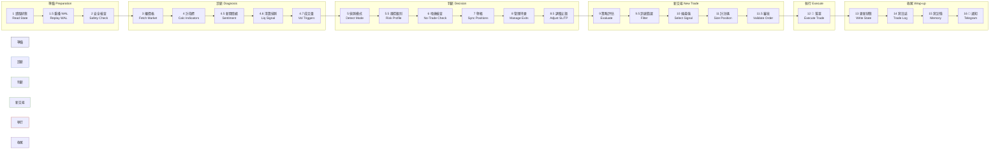

```mermaid
graph LR
    subgraph 準備 Preparation
        style 準備 Preparation fill:#f5f5f5,stroke:#666
        S1["1 讀取狀態\nRead State"]
        S15["1.5 重播 WAL\nReplay WAL"]
        S2["2 安全檢查\nSafety Check"]
    end

    subgraph 診斷 Diagnosis
        style 診斷 Diagnosis fill:#dae8fc,stroke:#6c8ebf
        S3["3 攞價格\nFetch Market"]
        S4["4 計指標\nCalc Indicators"]
        S45["4.5 新聞情緒\nSentiment"]
        S46["4.6 清算偵測\nLiq Signal"]
        S47["4.7 成交量\nVol Triggers"]
    end

    subgraph 判斷 Decision
        style 判斷 Decision fill:#d5e8d4,stroke:#82b366
        S5["5 偵測模式\nDetect Mode"]
        S55["5.5 風控級別\nRisk Profile"]
        S6["6 唔做檢查\nNo-Trade Check"]
        S7["7 對帳\nSync Positions"]
        S8["8 管理持倉\nManage Exits"]
        S85["8.5 調整止損\nAdjust SL/TP"]
    end

    subgraph 新交易 New Trade
        style 新交易 New Trade fill:#d5e8d4,stroke:#82b366
        S9["9 策略評估\nEvaluate"]
        S95["9.5 訊號篩選\nFilter"]
        S10["10 揀最強\nSelect Signal"]
        S11["11 計注碼\nSize Position"]
        S115["11.5 審批\nValidate Order"]
    end

    subgraph 執行 Execute
        style 執行 Execute fill:#f8cecc,stroke:#b85450
        S12["12 🔴 落單\nExecute Trade"]
    end

    subgraph 收尾 Wrap-up
        style 收尾 Wrap-up fill:#e1d5e7,stroke:#9673a6
        S13["13 更新狀態\nWrite State"]
        S14["14 寫日誌\nTrade Log"]
        S15b["15 寫記憶\nMemory"]
        S16["16 📱 通知\nTelegram"]
    end

    S1 --> S15 --> S2 --> S3 --> S4 --> S45 --> S46 --> S47
    S47 --> S5 --> S55 --> S6 --> S7 --> S8 --> S85
    S85 --> S9 --> S95 --> S10 --> S11 --> S115
    S115 --> S12 --> S13 --> S14 --> S15b --> S16
```
