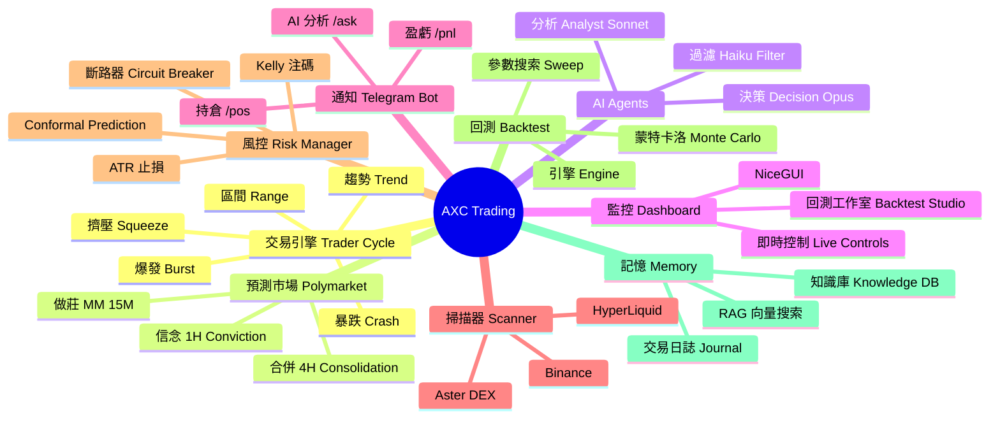

```mermaid
mindmap
  root((AXC Trading))
    交易引擎 Trader Cycle
      趨勢 Trend
      區間 Range
      暴跌 Crash
      擠壓 Squeeze
      爆發 Burst
    預測市場 Polymarket
      做莊 MM 15M
      信念 1H Conviction
      合併 4H Consolidation
    AI Agents
      過濾 Haiku Filter
      分析 Analyst Sonnet
      決策 Decision Opus
    監控 Dashboard
      NiceGUI
      即時控制 Live Controls
      回測工作室 Backtest Studio
    通知 Telegram Bot
      持倉 /pos
      盈虧 /pnl
      AI 分析 /ask
    掃描器 Scanner
      Aster DEX
      Binance
      HyperLiquid
    風控 Risk Manager
      ATR 止損
      Kelly 注碼
      斷路器 Circuit Breaker
      Conformal Prediction
    回測 Backtest
      引擎 Engine
      參數搜索 Sweep
      蒙特卡洛 Monte Carlo
    記憶 Memory
      RAG 向量搜索
      交易日誌 Journal
      知識庫 Knowledge DB
```
