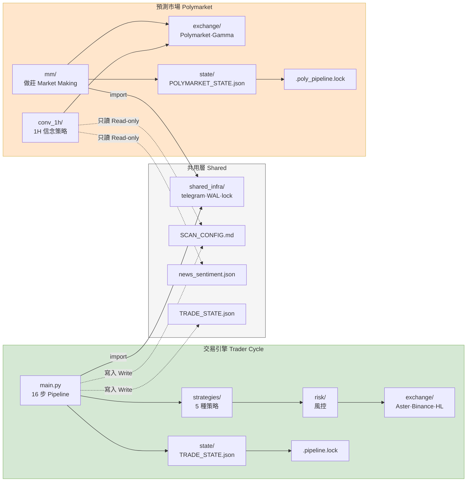

```mermaid
graph LR
    subgraph tc["交易引擎 Trader Cycle"]
        style tc fill:#d5e8d4,stroke:#82b366
        TC_MAIN["main.py\n16 步 Pipeline"]
        TC_STRAT["strategies/\n5 種策略"]
        TC_RISK["risk/\n風控"]
        TC_EX["exchange/\nAster·Binance·HL"]
        TC_STATE["state/\nTRADE_STATE.json"]
        TC_LOCK[".pipeline.lock"]
    end

    subgraph shared["共用層 Shared"]
        style shared fill:#f5f5f5,stroke:#666
        SI["shared_infra/\ntelegram·WAL·lock"]
        SC["SCAN_CONFIG.md"]
        NS["news_sentiment.json"]
        TS["TRADE_STATE.json"]
    end

    subgraph poly["預測市場 Polymarket"]
        style poly fill:#ffe6cc,stroke:#d6b656
        PM_MM["mm/\n做莊 Market Making"]
        PM_1H["conv_1h/\n1H 信念策略"]
        PM_EX["exchange/\nPolymarket·Gamma"]
        PM_STATE["state/\nPOLYMARKET_STATE.json"]
        PM_LOCK[".poly_pipeline.lock"]
    end

    TC_MAIN --> TC_STRAT --> TC_RISK --> TC_EX
    TC_MAIN --> TC_STATE
    TC_STATE --> TC_LOCK

    PM_MM --> PM_EX
    PM_1H --> PM_EX
    PM_MM --> PM_STATE
    PM_STATE --> PM_LOCK

    TC_MAIN -.->|寫入 Write| SC
    TC_MAIN -.->|寫入 Write| TS
    PM_1H -.->|只讀 Read-only| SC
    PM_1H -.->|只讀 Read-only| NS

    TC_MAIN -->|import| SI
    PM_MM -->|import| SI
```
