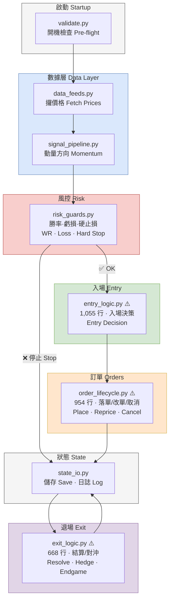

```mermaid
graph TD
    subgraph startup["啟動 Startup"]
        style startup fill:#f5f5f5,stroke:#666
        V["validate.py\n開機檢查 Pre-flight"]
    end

    subgraph data["數據層 Data Layer"]
        style data fill:#dae8fc,stroke:#6c8ebf
        DF["data_feeds.py\n攞價格 Fetch Prices"]
        SP["signal_pipeline.py\n動量方向 Momentum"]
    end

    subgraph risk["風控 Risk"]
        style risk fill:#f8cecc,stroke:#b85450
        RG["risk_guards.py\n勝率·虧損·硬止損\nWR · Loss · Hard Stop"]
    end

    subgraph entry["入場 Entry"]
        style entry fill:#d5e8d4,stroke:#82b366
        EL["entry_logic.py ⚠️\n1,055 行 · 入場決策\nEntry Decision"]
    end

    subgraph order["訂單 Orders"]
        style order fill:#ffe6cc,stroke:#d6b656
        OL["order_lifecycle.py ⚠️\n954 行 · 落單/改單/取消\nPlace · Reprice · Cancel"]
    end

    subgraph state["狀態 State"]
        style state fill:#f5f5f5,stroke:#666
        SIO["state_io.py\n儲存 Save · 日誌 Log"]
    end

    subgraph exit["退場 Exit"]
        style exit fill:#e1d5e7,stroke:#9673a6
        EX["exit_logic.py ⚠️\n668 行 · 結算/對沖\nResolve · Hedge · Endgame"]
    end

    V --> DF --> SP --> RG
    RG -->|✅ OK| EL
    RG -->|❌ 停止 Stop| SIO
    EL --> OL --> SIO
    SIO --> EX --> SIO
```
