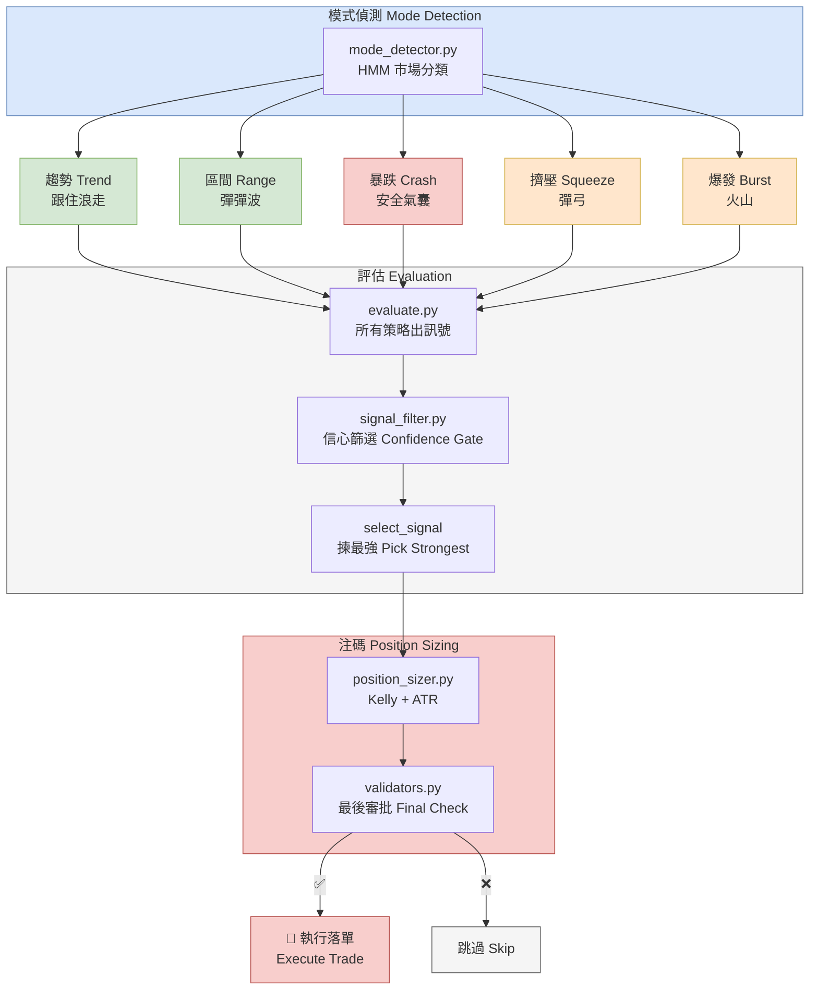

```mermaid
graph TD
    subgraph detect["模式偵測 Mode Detection"]
        style detect fill:#dae8fc,stroke:#6c8ebf
        MD["mode_detector.py\nHMM 市場分類"]
    end

    MD --> TREND["趨勢 Trend\n跟住浪走"]
    MD --> RANGE["區間 Range\n彈彈波"]
    MD --> CRASH["暴跌 Crash\n安全氣囊"]
    MD --> SQUEEZE["擠壓 Squeeze\n彈弓"]
    MD --> BURST["爆發 Burst\n火山"]

    style TREND fill:#d5e8d4,stroke:#82b366
    style RANGE fill:#d5e8d4,stroke:#82b366
    style CRASH fill:#f8cecc,stroke:#b85450
    style SQUEEZE fill:#ffe6cc,stroke:#d6b656
    style BURST fill:#ffe6cc,stroke:#d6b656

    subgraph eval["評估 Evaluation"]
        style eval fill:#f5f5f5,stroke:#666
        EV["evaluate.py\n所有策略出訊號"]
        SF["signal_filter.py\n信心篩選 Confidence Gate"]
        SEL["select_signal\n揀最強 Pick Strongest"]
    end

    TREND --> EV
    RANGE --> EV
    CRASH --> EV
    SQUEEZE --> EV
    BURST --> EV

    EV --> SF --> SEL

    subgraph sizing["注碼 Position Sizing"]
        style sizing fill:#f8cecc,stroke:#b85450
        PS["position_sizer.py\nKelly + ATR"]
        VL["validators.py\n最後審批 Final Check"]
    end

    SEL --> PS --> VL

    VL -->|✅| EXEC["🔴 執行落單\nExecute Trade"]
    VL -->|❌| SKIP["跳過 Skip"]

    style EXEC fill:#f8cecc,stroke:#b85450
    style SKIP fill:#f5f5f5,stroke:#666
```
