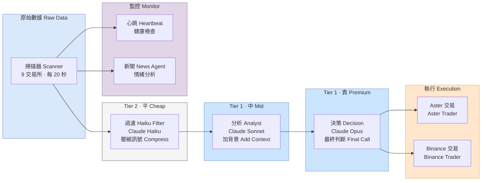

```mermaid
graph LR
    subgraph input["原始數據 Raw Data"]
        style input fill:#dae8fc,stroke:#6c8ebf
        RAW["掃描器 Scanner\n9 交易所 · 每 20 秒"]
    end

    subgraph tier2["Tier 2 · 平 Cheap"]
        style tier2 fill:#f5f5f5,stroke:#666
        HF["過濾 Haiku Filter\nClaude Haiku\n壓縮訊號 Compress"]
    end

    subgraph tier1a["Tier 1 · 中 Mid"]
        style tier1a fill:#cce5ff,stroke:#6c8ebf
        AN["分析 Analyst\nClaude Sonnet\n加背景 Add Context"]
    end

    subgraph tier1b["Tier 1 · 貴 Premium"]
        style tier1b fill:#cce5ff,stroke:#6c8ebf
        DEC["決策 Decision\nClaude Opus\n最終判斷 Final Call"]
    end

    subgraph exec["執行 Execution"]
        style exec fill:#ffe6cc,stroke:#d6b656
        AT["Aster 交易\nAster Trader"]
        BT["Binance 交易\nBinance Trader"]
    end

    subgraph monitor["監控 Monitor"]
        style monitor fill:#e1d5e7,stroke:#9673a6
        HB["心跳 Heartbeat\n健康檢查"]
        NA["新聞 News Agent\n情緒分析"]
    end

    RAW --> HF --> AN --> DEC
    DEC --> AT
    DEC --> BT
    RAW --> HB
    RAW --> NA
```
