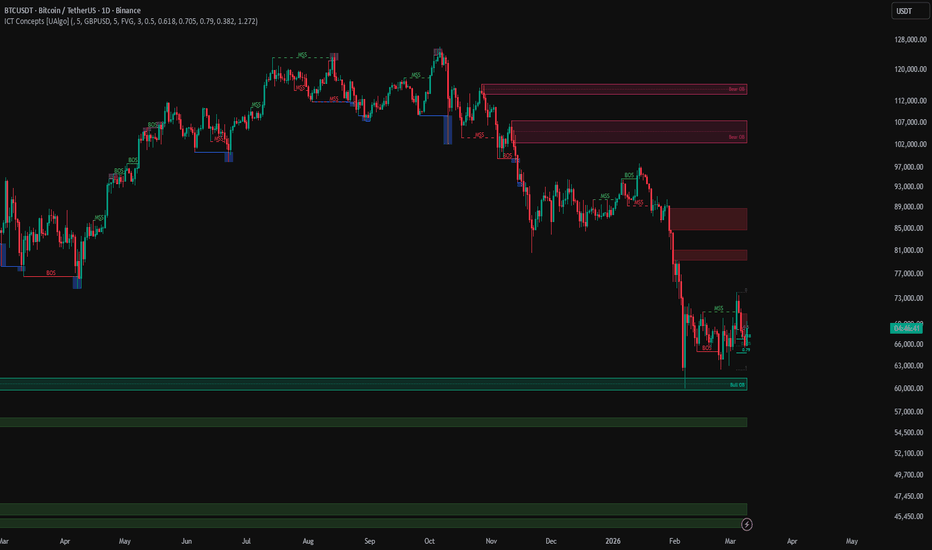

# ICT Concepts

> 作者: UAlgo
> 連結: https://tw.tradingview.com/script/AeUpvjaN-ICT-Concepts-UAlgo/
> 類型: Pine Script 指標

---

---

## 總覽

ICT Concepts 係一個廣泛既市場結構工具包，將多個核心 ICT 風格元素結合响單一腳本入面。

指標將 order blocks、market structure shifts、SMT divergence、fair value gaps、balanced price ranges、consequent encroachment、liquidity sweeps、fibonacci levels、同 killzones 整合響一個集成既 overlay 度。

---

## 功能模組

### 1. Order Blocks (訂單塊)

使用嚴格既三燭位移圖案檢測上升同下降 order blocks。當有效設置出現時，order block 被存儲、向前延伸，只有响消除後先至移除。

可選 mean threshold lines 都可以在每個 block 入面顯示。

**Multi Timeframe Order Blocks**: 可以通過 request.security 响選定既時間框架上運行 order block 檢測。

### 2. Market Structure Mapping (市場結構映射)

追蹤 pivot highs 同 lows，將確認既結構突破標記為 BOS 或 MSS。

- **BOS** (Break of Structure) — 持續現有結構
- **MSS** (Market Structure Shift) — 方向特徵既轉變

### 3. SMT Divergence Detection

可以將 active chart 同第二隻symbol比較，使用 both instruments 既 pivot highs 同 lows 檢測 SMT divergence。

Divergence 直接標記响主圖表上，都可以响一個小型比較面板度反映。

### 4. Fair Value Gaps

通過經典既三燭 gap 條件檢測上升同下降既公平價值缺口。

呢啲 imbalances 被存儲、向前延伸，一旦價格穿過就移除。

### 5. Balanced Price Range

當新既公平價值缺口與相反側歷史公平價值缺口重疊，重疊部分成為 balanced price range。

### 6. Liquidity Sweep Detection

指標監控最近既 pivot highs 同 lows，標記 price 交易超過其中一個水平但收盤返回穿過既時候。

呢個令本地買方同賣方 sweeps 容易被發現。

### 7. Structure Anchored Fibonacci Levels

確認既結構突破後，從突破極端到相反結構點之間錨定 Fibonacci levels。

然後 Equilibrium、OTE、同可選既額外水平向前投影。

### 8. Killzone Rendering

可以標記 Asian、London、New York AM、同 New York PM 會話窗口。

歷史會話盒子為定義既最近發生次數保留。

---

## State-Aware 特性

呢個 script 既最強特性之一係每個模組都係 state aware：

- Order blocks 延伸到消除為止
- Fair value gaps 延伸到價格穿過為止
- Structure anchors 响新突破後更新
- Killzones 歷史保留
- SMT events 被存儲、標記、可選投影到小型比較面板

---

## Alert 條件

為上升同下降 order block 檢測包含 alert 條件。

---

*最後更新: 2025-03-11*
