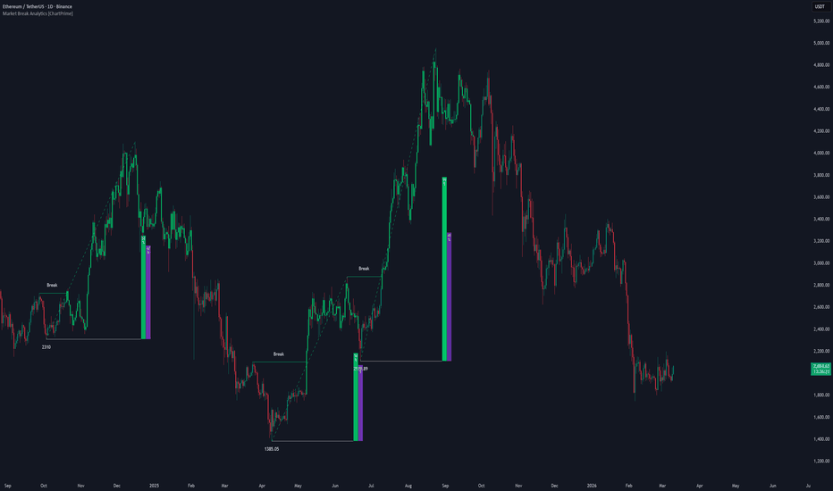

# Market Break Analytics

> 作者: ChartPrime
> 連結: https://tw.tradingview.com/script/0vET13Ra-Market-Break-Analytics-ChartPrime/
> 類型: Pine Script 指標

---

---

## 總覽

Market Break Analytics 係一個結構動量同成交量分佈工具，專門設計用於分析確認既 pivot 突破同測量每次結構移動既參與度。

呢個指標唔只標記突破，而是建立完整既結構地圖：
- 識別被突破既 pivot
- 定位真正既擺動起點
- 測量擴張期間既成交量主導
- 顯示買/賣參與度作為百分比強度

---

## 核心結構邏輯

指標追蹤確認既 Pivot High 同 Pivot Low。只有當收盤價超越確認既 pivot level 後，先至發生結構突破。

- **Break Up mode** → 追蹤高於 pivot highs 既上升突破
- **Break Dn mode** → 追蹤低於 pivot lows 既下降突破

趨勢方向只有當相反既結構突破確認後先至翻轉。呢個確保工具響應真正既結構轉變，而非暫時既波動性飆升。

---

## 擺動起源檢測

一旦突破發生：
- 算法向後掃描找到最低低點（對於上升突破）
- 或者最高高點（對於下降突破）
- 呢個擺動起源成為結構基礎

從起源到當前結構繪製一條基準線。虛線擴張線視覺化active既擺動。

---

## 成交量參與度分析

呢個工具既獨特組件係 in-swing volume distribution model。

每次結構腿：
- 測量總買入成交量（收盤 > 開盤）
- 測量總賣出成交量（收盤 < 開盤）
- 計算百分比主導
- 響擺動完成附近繪製買/賣盒子
- 顏色強度反映參與強度

呢個回答關鍵問題：突破係由強參與仲係弱動量驅動？

---

## 趨勢著色

Bars 根據 active 既結構方向自動著色：
- 上升結構 → 上升顏色
- 下降結構 → 下降顏色
- 冇 active結構 → 默認圖表顏色

---

## 使用建議

1. 响上升市場階段使用 Break Up mode
2. 响下降市場階段使用 Break Dn mode
3. 上升突破期間觀察高買入百分比以獲得強持續設置
4. 突破期間觀察弱參與以發現潛在 fakeouts
5. 結合流動性或 order block 工具獲得匯合

---

*最後更新: 2025-03-11*
