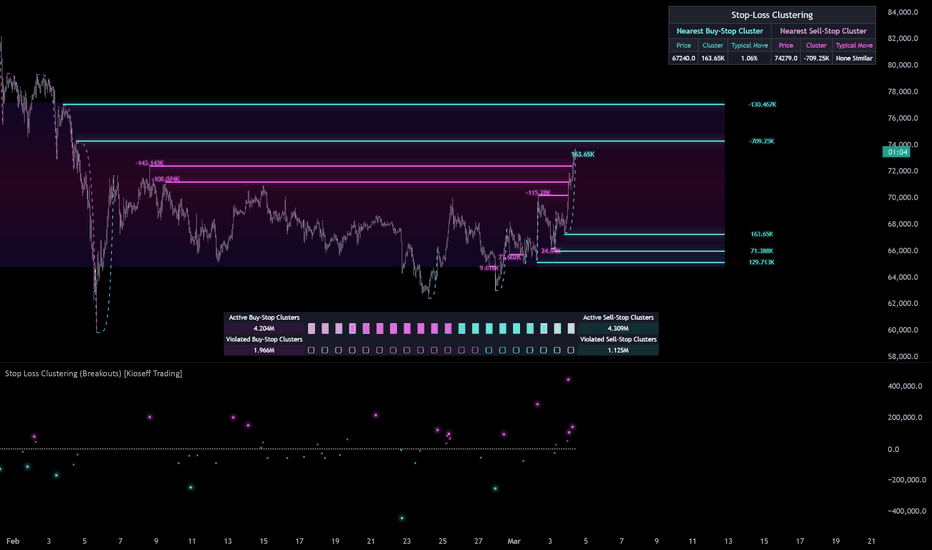

# Stop Loss Cascades (Breakouts)

> 作者: KioseffTrading
> 連結: https://tw.tradingview.com/script/CJX3k6l2-Stop-Loss-Cascades-Breakouts-Kioseff-Trading/
> 類型: Pine Script 指標

---

---

## 功能

模擬交易者止損單配置邏輯，識別止損單可能集中的價格區域。當大量止損單集中在某區域，價格突破可能產生高速動能。

---

## 原理

### Liquidity, Behavior, and Stop Cascades

市場通過連續既限價訂單簿運作，兩種基本訂單類型互動：
- **Limit orders** — 通過掛單提供流動性
- **Market orders** — 通過吃單消耗流動性

呢個互動驅動價格移動 —  incoming order flow 消耗可用流動性。

流動性唔會均勻分佈，形成局部集中同缺口。流動性集中通常稱為 liquidity shelves / liquidity clusters / liquidity zones。

### Stop-Loss Clustering

停損單添加另一層潛在訂單流，唔會响訂單簿度顯示直到觸發。如果足够多既停損單坐响同一價格區域...

諗下「隱藏既壓力」等待激活。價格附近交易時冇事發生，但一旦果個水平被交易，那些停損單轉換成市價單，開始消耗更多流動性，推動價格進一步進入下一層停損單。

呢個就係點解啲 reference-point breaks 有啲慢咁少移動，有啲加速得好快。

---

## 模型

### 1. Absorption Extremes Model

將最近同相關既擺動點視為可能既停損集中候選點。

**假設限制**：
- 指標將所有「方向成交量」分配俾擺動水平
- 假設所有倉位既止損擺動水平基於方向結構性失效

### 2. Volatility-At-Entry Model (Time Scaled)

使用 ATR 按各種時間框架縮放去預測可信既止損單放置位置。

- 6 個常見時間框架：1m, 5m, 15m, 30m, 1h, 4h
- 3 個常見 ATR 倍數：1ATR, 1.5ATR, 2ATR

---

## 學術參考

- Madhavan (2000) - Market microstructure: A survey
- O'Hara (1995) - Market Microstructure Theory
- Kavajecz & Odders-White (2004) - Technical analysis and liquidity provision
- Osler (2003, 2005) - Stop-loss orders and price cascades
- Bouchaud, Farmer & Lillo (2009) - How markets slowly digest changes in supply and demand

---

## 使用建議

呢個指標幫助理解點解某啲突破加速而其他停滯。但記住，呢啲模型係近似值，非直接測量。

真正既止損位置同大小係公開唔到既。好多交易者使用不同既風險管理技術，唔可以完美地從圖表數據推斷。

指標既目的係highlight停壓力可能集中既價格區域，而非精確定位止損。

---

*最後更新: 2025-03-11*
