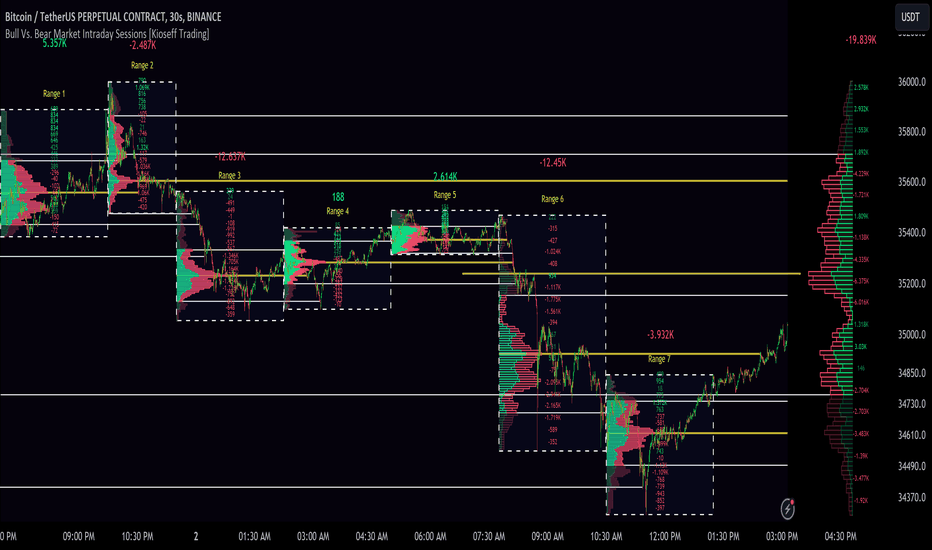

# 10x Bull Vs. Bear VP Intraday Sessions

> 作者: KioseffTrading
> 連結: https://tw.tradingview.com/script/3mKewfnN-10x-Bull-Vs-Bear-VP-Intraday-Sessions-Kioseff-Trading/
> 類型: Pine Script 指標

---

---

## 功能

呢個 Script 「10x Bull Vs. Bear VP Intraday Sessions」讓你配置多達 10 個 session ranges 去做 Bull Vs. Bear volume profiles！

---

## Features

- **多達 10 個固定範圍** — 可以設置 10 個不同既時間段
- **Volume Profile 錨定到固定範圍** — 唔再受時間限制
- **Delta Ladder 錨定到範圍** — 顯示每段既 Delta 數據
- **Bull vs Bear Profiles** — 分開顯示買入同賣出成交量
- **標準 POC 同 Value Area Lines** — 另有分開既 Bull 同 Bear POC 同 Value Area
- **可配置 Value Area 目標** — 你話事
- **多達 2000 Profile Rows** — 每個 visible range
- **Stylistic Options** — 自定義 profile 外觀

---

## 數據顯示

- **綠色 profiles** = 買入成交量
- **紅色 profiles** = 賣出成交量

所有顏色都可以自定義配置。

每個固定 range 既 bullish & bearish POC + value areas 都可以選擇顯示與否。

---

## 使用場景

適合日內交易者，想分析特定交易時段既 Bull vs Bear 成交量分佈。

例如：
- 開市時段 (Opening Range)
- 美股主要交易時段
- 亞洲交易時段
- 任何你自己定義既時段

---

*最後更新: 2025-03-11*
