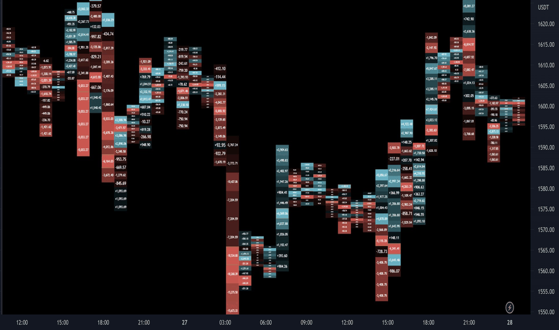

# Delta Ladder

> 作者: KioseffTrading
> 連結: https://tw.tradingview.com/script/EkBUz93v-Delta-Ladder-Kioseff-Trading/
> 類型: Pine Script 指標

---

---

## 功能

呢個 Script 以多種形式呈現 Volume Delta 數據！

---

## 模式

### Classic Mode
Delta blocks 根據正/負值向左/向右排列

### On Bar Mode
Delta blocks 重疊响蠟燭上面
- 左邊既 blocks = 負 delta
- 右邊既 blocks = 正 delta

### Pure Ladder Mode
Delta blocks 保持同佢地計算既蠟燭一樣既 x-axis

---

## Features

- **Volume Delta Boxes** — 顯示每個價格水平既 delta
- **PoC Highlighting** — 標記 Point of Control
- **Color-coordinated** — 根據 delta 大細分配顏色
- **Merged Boxes** — 可以合併 delta boxes 同移除 delta 值，生成顏色ONLY既 canvas
- **Split Price Bars** — 價格 bars 可以分割多達 497 次，等你可以更精確咁睇每個價格水平既 volume delta
- **Total Volume Delta** — 顯示每枝蠟燭既 total volume delta 同 timestamp

---

## Volume Assumption

當開啟呢個設定既時候，indicator 會假設 60/40 split — 當一個水平被交易既時候，如果有得揀「買入成交量」或者「賣出成交量」其中一個被記錄既話，咁就會用 60/40 split。

---

## 使用建議

適合進階既 Volume Profile 同 Order Flow 交易者。Delta Ladder 可以幫你：
- 睇清邊個價格水平既買/賣壓力最大
- 識別absorption（吸收）區域
- 睇市場係咪進行緊「再平衡」(rebalancing)

---

*最後更新: 2025-03-11*
