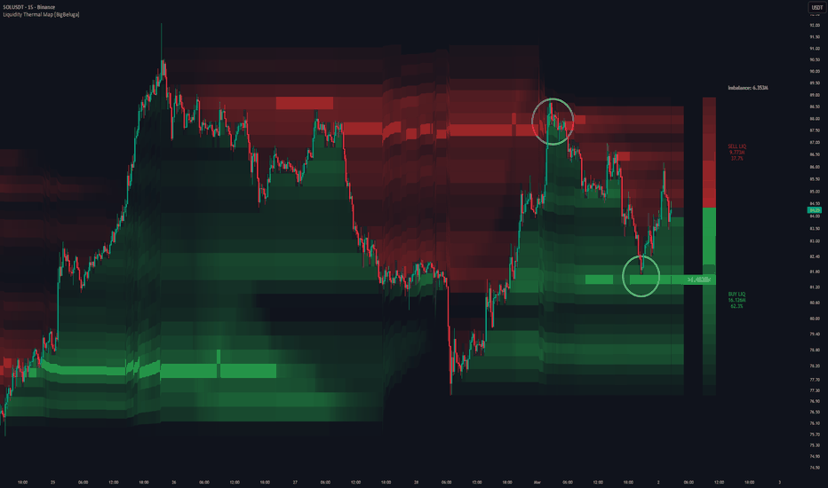

# Liquidity Thermal Map

> 作者: BigBeluga
> 連結: https://tw.tradingview.com/script/G30eUYdH-Liquidity-Thermal-Map-BigBeluga/
> 類型: Pine Script 指標

---

---

## 總覽

Liquidity Thermal Map 視覺化指定回溯期內最高成交量累積既價格水平。

取代使用經典既成交量 profile bars，指標直接在圖表上建立水平既 thermal heatmap，使用平滑既顏色梯度 highlight 強同弱既流動性。

呢個令識別高興趣價格區域、成交量集群、同 dominant Point of Control (PoC) 一目了然。

---

## 概念

### Price-Level Volume Aggregation
指標將選定回溯期既整個價格範圍分為固定既水平 bins。

### Volume Binning
每當收盤價接近其中間點時，每個 bin 累積總成交量。

### Thermal Gradient Mapping
成交量強度翻譯成顏色梯度，形成連續既流動性熱圖。

### Point of Control (PoC)
累積成交量最高既價格水平使用獨特既 PoC 顏色 highlight。

---

## 功能

- **Liquidity Heatmap** — 直接响圖表背景顯示水平成交量集中
- **Fixed Resolution Bins** — 使用 30 個均勻分布既價格水平保持乾淨同可讀既結構
- **Adaptive Lookback Period** — 成交量只响用戶定義既歷史窗口內計算
- **Two-Stage Color Gradient**:
  - Low volume → transparent / muted tones
  - High volume → stronger, warmer colors
- **PoC Highlighting** — 最重要成交量水平使用專用 PoC 顏色同成交量標籤強調
- **Range-Aware Scaling** — 自動適應回溯期內最高同最低價格

---

## 買/賣流動性比例

右側既垂直比例總結左總成交量响分析範圍內上升同下降蠟燭之間既分佈方式：

- **Buy Liquidity (Green)** — 收盤高於開盤既蠟燭期間既總成交量。呢個近似積極既買入壓力。
- **Sell Liquidity (Red)** — 收盤低於開盤既蠟燭期間既總成交量。呢個反映賣出壓力支配既時期。
- **Liquidity Percentage** — 每側顯示總成交量既份額百分比
- **Volume Imbalance** — 顯示 total buy 同 total sell liquidity 之間既絕對差異

---

## 使用建議

1. **識別流動性集群** — 明亮或密集既區域表示發生顯著交易活動既價格
2. **支撐阻力上下文** — 高成交量區域通常作為價格反應區域
3. **PoC 追蹤** — PoC 顯示市場花費最多時間同成交量既位置
4. **突破意識** — 離開密集流動性區域既移動可能標誌擴張到低成交量區域
5. **上下文分析** — 將熱圖用作流動性背景參考，配合趨勢或結構工具

---

*最後更新: 2025-03-11*
