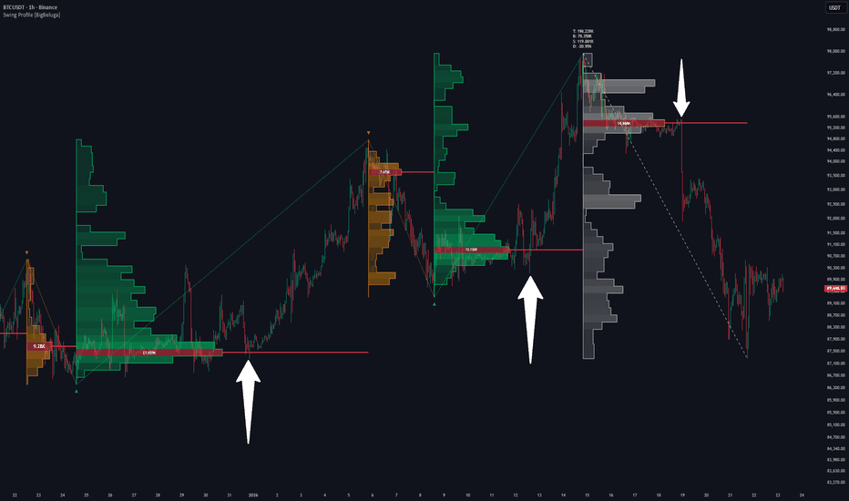

# Swing Profile

> 作者: BigBeluga
> 連結: https://tw.tradingview.com/script/gFlv7t7R-Swing-Profile-BigBeluga/
> 類型: Pine Script 指標

---

---

## 總覽

Swing Profile 係一個動態既擺動成交量分析工具，為每個已完成既市場擺動建立完整成交量 Profile。

取代使用固定既交易時段或時間範圍，指標將其 Profile 嚴格錨定於確認既擺動高點同低點之間，令交易者能夠分析每個方向腿內既成交量累積位置。

Profile 响擺動形成期間即時更新，一旦擺動方向反轉就完成，为交易者提供歷史同實時既成交量行為洞察。

---

## 概念

### Swing-Anchored Profiling
成交量只係响確認既擺動高點同低點之間計算。

### Directional Legs
每個上升或下降既擺動腿都有自己既獨立成交量 Profile。

### ATR-Adaptive Bins
Profile 大小使用 ATR 自動縮放，响唔同波動制度下保持一致既分辨率。

### Real-Time Rebuild
當擺動仍然形成時，Profile 不斷重新計算同重繪。

### Finalized Profiles
一旦方向反轉，Profile 鎖定並標記為已完成既擺動。

---

## 功能

- **Swing Volume Profile** — 顯示每個擺動腿既橫向成交量分佈
- **Point of Control (PoC)** — highlight成交量最高既價格水平
- **Buy / Sell Volume Separation** — 追蹤每個 Profile 入面既上升（買入）同下降（賣出）成交量
- **Delta Volume Calculation** — 顯示淨買入同賣出壓力既百分比
- **Profile Outline** — ポリライン追踪成交量分佈既外觀形狀
- **HeatMap Mode** — 可選既熱圖視覺化，透過顏色梯度顯示成交量強度
- **ZigZag Swing Connector** — 擺動高點同低點之間既視覺連接
- **Custom Label Sizing** — 調整標籤大小

---

## 數據標籤

- **T** — 擺動內既總成交量
- **B** — 買入成交量（上升蠟燭）
- **S** — 賣出成交量（下降蠟燭）
- **D** — Delta 成交量（買入同賣出成交量之間既百分比差異）

---

## 使用建議

1. **識別高興趣區域** — 用 PoC 定位價格水平，市場响擺動期間花費最多時間既位置
2. **趨勢強度分析** — 強方向性既擺動通常顯示成交量偏向 Profile 既一側
3. **回調區域** — Profiles 有助識別價格响回調期間可能反應既區域
4. **持續對比逆轉** — Delta成交量揭示買入或賣出响擺動期間是否佔主導
5. **實時監控** — 當擺動形成時，觀察實時 Profile 以預期結構可能响邊度完成

---

*最後更新: 2025-03-11*
