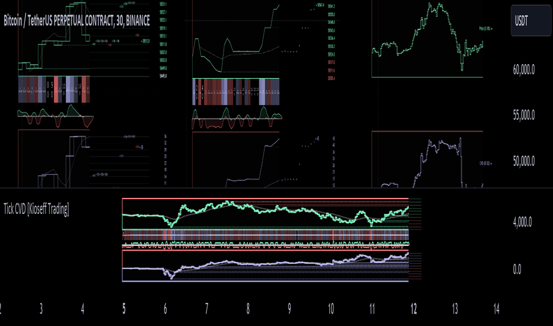

# Tick CVD (Cumulative Volume Delta)

> 作者: KioseffTrading
> 連結: https://tw.tradingview.com/script/moMbNm8e-Tick-CVD-Kioseff-Trading/
> 類型: Pine Script 指標

---

---

## 功能

呢個 Script 「Tick CVD」使用 live tick data 計算 CVD 同 volume delta！唔需要 tick chart。

---

## 特點

- **Live Price Ticks** — 記錄實時價格 ticks
- **CVD 計算** — 使用 live ticks 計算 Cumulative Volume Delta
- **Delta 計算** — 使用 live ticks 計算 delta
- **Tick-based Moving Averages** — 可選擇 HMA, WMA, EMA, SMA
- **Key Tick Levels** — 記錄同顯示 S/R CVD & price 既關鍵水平
- **Price/CVD 顯示** — 可以選擇顯示做蠟燭或者線
- **Polyline** — 數據視覺化唔受 500 點限制
- **Efficiency Mode** — 移除所有花哨野，等你可以快速計算/顯示 tick CVD 同 price

---

## 點運作？

雖然歷史 tick-data 非專業訂閱者唔可以取得，但 live tick data 可以通過程序話取。

因此，呢個 Indicator 會記錄 live tick data 去為用家計算 CVD、delta 同其他指標。

一般 Pine Scripts 使用以下規則計算 volume/price 相關指標：
- **Bullish Volume**：Close > Open
- **Bearish Volume**：Close < Open

但呢個 Script 改進左呢個邏輯，透過使用 live ticks。佢唔再依賴時間序列圖表，而係記錄 up ticks 為買入成交量同 down ticks 為賣出成交量。

---

## 可視化

### Tick CVD & Price Tick Graph
- **綠色** = 價格高於起始點（第一次 load script 既時候）
- **紅色** = 價格低於起始點
- **藍色** = CVD > 0
- **紅色** = CVD < 0

### Delta Boxes
- **藍色盒** = 買入成交量
- **紅色盒** = 賣出成交量
- **明亮既** = 高成交量（相對）
- **暗淡既** = 低成交量（相對）

---

## 使用建議

適合進階既 Order Flow 交易者，特別係想使用真實既 tick-by-tick 數據去做交易決定既人。

Efficiency Mode 建議响快速既市場度開啟，等 script 運行更快。

---

*最後更新: 2025-03-11*
