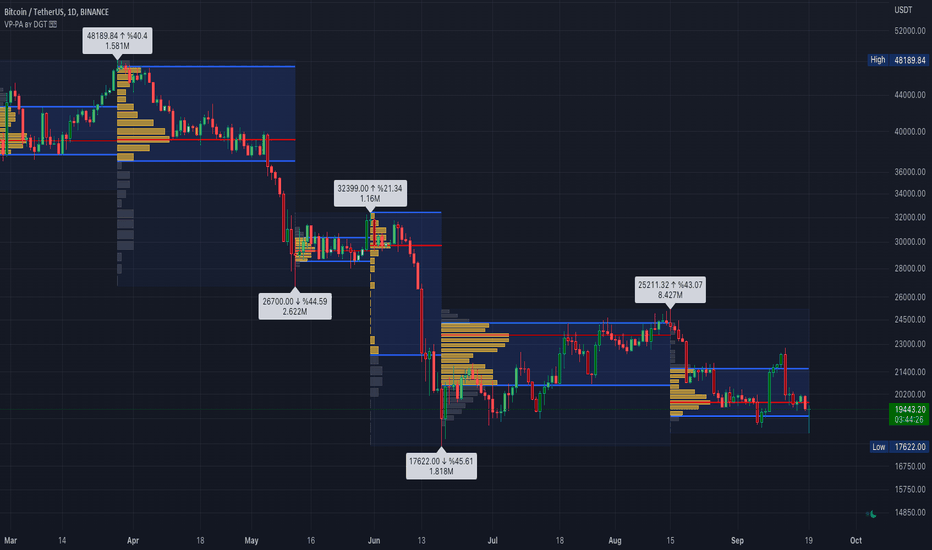

# Volume Profile, Pivot Anchored

> 作者: dgtrd
> 連結: https://tw.tradingview.com/script/utCRHZeP-Volume-Profile-Pivot-Anchored-by-DGT/
> 類型: Pine Script 指標

---

---

## 功能

Volume Profile（又叫 Price by Volume）係一個 charting study，顯示係特定時間段內、特定價格水平上既交易活動。

佢以水平直方圖既形式繪製响 chart 度，highlight 交易者對特定價格水平既興趣。

---

## 點解叫 Pivot Anchored？

因為呢個 Volume Profile 係根據 Pivot Levels 確定既時間段度繪製既。

呢個 Indicator 使用 Pivot Points High Low indicator 去present 呢個 Custom indicator。

---

## 應用場景

### Anchored to Session, Week, Month
可以將 Volume Profile 錨定到：
- 每日 Session
- 每周
- 每月
- 或者任何你自己定義既時間段

### Custom Range, Interactive
可以自定義範圍，interactive 地調整

### Fixed Range with Volume Indicator
配合固定範圍既 Volume Indicator

### Combined with Support and Resistance
結合支撐同阻力指標

### Combined with Supply and Demand Zones
結合 Supply and Demand Zones，等你可以睇清楚邊啲區域有高成交量

---

## 附加功能

Indicator 仲包含埋：
- **Volume Weighted Colored Bars** — 根據成交量加權既顏色 bars，等你可以更容易咁睇到邊啲價格水平最重要

---

## 使用建議

✅ 交易成功既關鍵係跟隨你既交易策略
✅ Indicator 應該配合你既交易策略，而唔係單靠佢地去交易
⚠️ 呢個 Script 既目的係資訊同教育用途
⚠️ 使用 Script 既風險由你自己負責

---

*最後更新: 2025-03-11*
