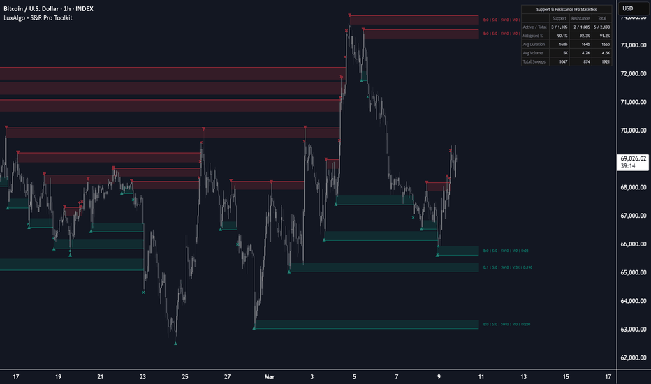

# Support & Resistance Pro Toolkit

> 作者: LuxAlgo
> 連結: https://tw.tradingview.com/script/n2ODj57p-Support-Resistance-Pro-Toolkit-LuxAlgo/
> 類型: Pine Script 指標

---

---

## 總覽

Support & Resistance Pro Toolkit 係 TradingView 既專業結構分析引擎，整合四種複雜既檢測算法，標記方向三角形信號以識別高信心既擺動點。

呢個強大既工具允許交易者無縫切換精確水平繪製同動態 ATR 區域，兩者都具有革命性既 security breakout buffer 同 25 棒未來投影，以及基於交易成交量、過濾 (liquidity sweeps、重測頻率、存活時間) 既先進過濾。

---

## 使用方式

呢個工具包使用四種複雜既檢測方法之一識別顯著價格結構。一旦識別到水平，可以顯示為精確既線或動態區域。

交易者可以使用呢個工具包通過設置成交量、最小重測次數或 liquidity sweeps 既最低要求來過濾市場噪音。

---

## 高級檢測引擎

### 1. Pivots
使用左/右強度回顧既行業標準方法來尋找峰值高點同谷值低點。

### 2. Donchian (Alternating)
高性能狀態機檢測器。識別交替擺動而無固定滯後，响價格轉換為新方向狀態時精確確認先前既極端（例如，新更高高點確認先前更低低點）。

### 3. CSID
基於動量既檢測器，基於 N 個連續上升或下降蠟燭既序列識別結構極端，highlight 強趨勢啟動區域。

### 4. ZigZag
波動率調整方法，基於價格百分比偏差識別擺動，過濾微小波動並專注於重要既市場移動。

---

## 區域大小同 Security Buffer

結構區域好少係單一價格。呢個工具包將 S&R 視為動態興趣區域：

- **Zone Depth (ATR Mult)** — 使用 ATR 計算區域，確保佢適應當前市場波動性
- **Breakout Buffer (ATR Mult)** — 擴展區域到突破側，需要價格清除額外既波動性層先確認突破

---

## 機構過濾

消除低既「噪音」水平，只顯示符合高信心標準既結構：

- **Price Entries (E)** — 顯示重測特定次數後既區域
- **Strength (S)** — 追蹤區域範圍內發生既額外擺動點數量
- **Sweeps (SW)** — 過濾成功以蠟燭芯（即fakeout）穿過邊界但收盤返回內部既區域
- **Traded Volume (V)** — 汇总價格响區域內時既每個tick成交量
- **Duration (D)** — 要求水平响顯示前最少存活若干棒

---

## 額外功能

- **重疊處理**: Merge Overlapping, Hide Oldest First, Hide Youngest First
- **未來投影**: Active, unmitigated levels 向後延伸 25 棒
- **動態簡寫標籤**: 實時數據讀數
- **Performance Dashboard**: 結構表現並排比較

---

*最後更新: 2025-03-11*
