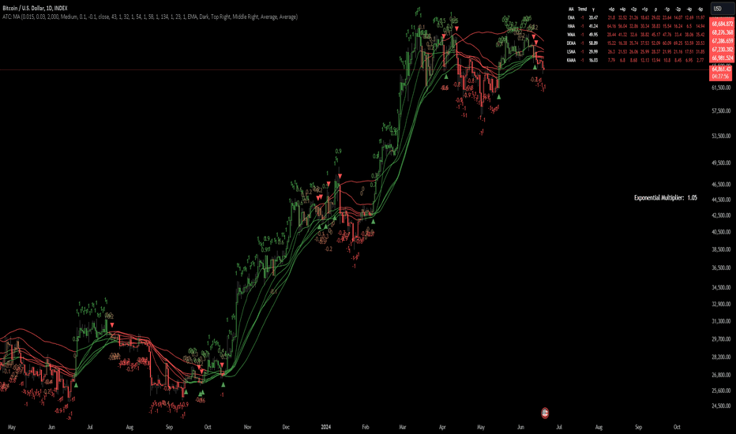

# Adaptive Trend Classification: Moving Averages

> 作者: InvestorUnknown
> 連結: https://tw.tradingview.com/script/L6NreqzB-Adaptive-Trend-Classification-Moving-Averages-InvestorUnknown/
> 類型: Pine Script 指標

---

---

## 功能

Adaptive Trend Classification (ATC) Moving Averages Indicator 係一個強勁同彈性既投資工具，基於各類型既移動平均線同佢地既長度提供動態信號。

呢個 Indicator 整合左多層 adaptivity 去加強响唔同市場條件下既有效性。

---

## Key Features

### Adaptability of Moving Average Types and Lengths
- 使用唔同類型既 MA (EMA, HMA, WMA, DEMA, LSMA, KAMA)
- 可自定義長度去調整到市場條件

### Dynamic Weighting Based on Performance
- 根據每個 MA 產生既 equity 分配權重
- 考慮 CutOut Period 同 Decay Rate 去管理過去表現既影響力

### Exponential Growth Adjustment
- 通過可調整既 exponential growth factor 增强最近表現既影響
- 確保最近既數據對信號有更大既影響

### Calibration Mode
- 允許用家微調 Indicator 設置，等特定信號時期同 backtesting 優化

### Visualization Options
- 多種自定義選項：繪製 MA、顏色 bars、信號箭嘴
- 增強視覺輸出既清晰度

### Alerts
- 可配置既 alert 設置，等你可以响特定 MA crossover 或者 average signal 既時候收到通知

---

## 計算邏輯

1. **Rate of Change (R)** — 計算價格既變化率
2. **Set of Moving Averages** — 為每種 MA 類型生成多個唔同長度既 MA
3. **Exponential Growth Factor** — 基於當前 bar index 同 growth rate 計算
4. **Equity Calculation** — 基於起始 equity、信號、同變化率計算equity，結合自然 decay rate
5. **Signal Generation** — 基於 crossovers 生成信號，並從所有 MA 既加權信號計算最終信號

---

## 使用建議

適合想結合多個移動平均線並利用基於表現既動態權重既交易者。

呢個指標既目的係提供可靠同及時既投資信號，透過整合唔同 MA 既優勢，同時根據最近表現調整權重。

---

*最後更新: 2025-03-11*
