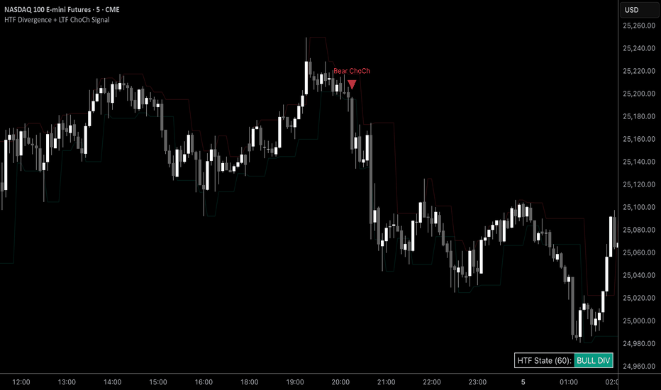

# HTF Divergence + LTF ChoCh Signal

> 作者: gabegab1
> 連結: https://tw.tradingview.com/script/DxenecWS-HTF-Divergence-LTF-ChoCh-Signal/
> 類型: Pine Script 指標

---

---

## 總覽

識別趨勢：將 HTF Timeframe 輸入設置為顯著高於你當前圖表既時間框架（例如，如果你交易 15m，設置 HTF 為 4h）。

---

## 使用方式

### 1. 識別趨勢

將 HTF Timeframe 輸入設置為顯著高於你當前圖表既時間框架。

例如：
- 交易 15m → 設置 HTF 為 4h
- 交易 1h → 設置 HTF 為 1D
- 交易 4h → 設置 HTF 為 1W

### 2. 等待確認

監控 Dashboard 等待 "Active" HTF 狀態。

### 3. 執行

當 LTF 結構在 HTF 偏置設置後突破，出現信號三角形。

---

## 上下文

呢個指標响關鍵流動性水平（such as Daily/Weekly Highs/Lows or Supply/Demand zones）產生信號時最有效。

---

## 設置

- **HTF Timeframe** — 用於背離檢測既較高時間框架
- **RSI Length** — RSI 計算既回溯週期
- **Pivot Lookback (HTF/LTF)** — 決定擺動高點同低點檢測既靈敏度
  - 較低值產生較多信號
  - 較高值產生較保守信號

---

## 風險警告

交易涉及重大風險。呢個指標僅供教育同信息目的，不構成財務建議。

過去表現並不代表未來結果。始終使用適當既風險管理。

---

*最後更新: 2025-03-11*
