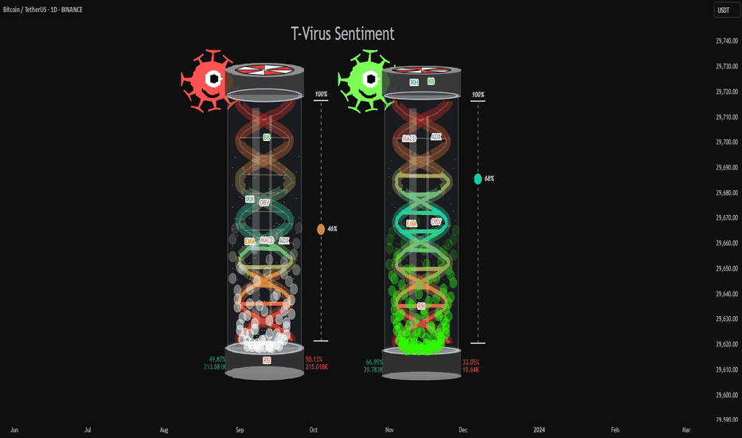

# T-Virus Sentiment

> 作者: hapharmonic
> 連結: https://tw.tradingview.com/script/jpbq3J0S-T-Virus-Sentiment-hapharmonic/
> 類型: Pine Script 指標

---

---

## 功能

🧬 T-Virus Sentiment — 可視化市場既 DNA

呢個 Indicator 既主要目標係通過分析價格行動既「基因密碼」去量度市場情緒既強度同方向，通過各種可信既技術分析工具。

結果顯示為：
- DNA helix 內既液體水平
- 代表買入壓力既泡泡密度
- 反映整體情緒既 T-Virus mascot

---

## 4 個核心元素

### 1. The Virus Mascot
一個即時既情緒提示。呢個角色提供最快既市場情緒讀數，結合情緒同成交量壓力。

### 2. The Antiviral Serum Level
主要既量化輸出。呢個係 DNA helix 度既液體水平，同埋右邊既百分比 gauge，代表所有 7 個指標既平均情緒分數。

### 3. Buy Pressure & Bubble Density
呢個視覺化 volume flow。泡泡既密度代表累積（買入）對分佈（賣出）既強度 — 就係呢個移動既「 power」。

### 4. The Signal Distribution
呢個顯示情緒既 confluence（或者分散）。所有信號係咪 bullish 同 clustering 响頂部？定係分散，話俾你知市場有衝突？

---

## 7 個技術分析工具

每個工具每支蠟燭都會被分析，並分配 1-5 分既分數：

1. **RSI** — 相對強弱指數
2. **EMA** — 指數移動平均線
3. **MACD** — 移動平均匯聚/發散
4. **ADX** — 平均方向指數
5. **Ichimoku Cloud** — 一目均衡表
6. **Bollinger Bands** — 布林帶
7. **OBV** — 能量潮

---

## 情緒分數範圍

| 分數 | 市場狀態 |
|------|----------|
| < 25% | 強烈bearish，控制權在賣家 |
| 25-50% | 仍然 bearish，但可能有早期累積跡象 |
| 50% | 中性 / 側向，等待新方向 |
| 50-75% | Bullish 勢頭變得清晰 |
| > 75% | 強烈 bullish，可能接近超買 |

---

## 使用建議

⚠️ 呢個 Indicator 係一個情緒 dashboard，唔係直接既買/賣信號產生器。

佢既強項係顯示 confluence 同提供快速、整體既市場技術健康狀況既 view。

**用途**：
- 確認工具：用「Active %」gauge 去確認你主要策略既交易設定
- 勢頭同趨勢 Gauge：高分數 (>75%) 表示強勢既 bullish 勢頭
- 分離同警告系統：注意 price 同 sentiment score 既分離

---

*最後更新: 2025-03-11*
