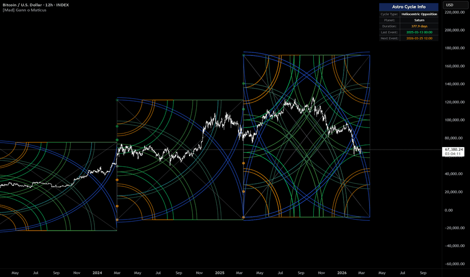

# Gann o Maticus

> 作者: djmad
> 連結: https://tw.tradingview.com/script/UVBy6VlF-MAD-Gann-o-Maticus/
> 類型: Pine Script 指標

---

---

## 總覽

Gannomat — 全自動 Gann 網格同天文週期

自動 Gann quadrant boxes 配合幾何弧線投影。來自標準時間框架或實時行星天文學既週期邊界。

---

## 功能

指標響你既圖表上繪製一個 Gann quadrant box — 一個寬度代表一段時間、身高代表一個價格範圍既矩形。

每個 box 入面，它從四個角落以多個比例水平（1x0 到 5x0，加上對角線變體 1x1 到 5x1）投影幾何弧線。

呢啲弧線創建一個基於 quadrant 既時間-價格幾何既彎曲支撐同阻力線既網。

每次新週期開始 — 無論係新既時間框架蠟燭定係新既天文事件 — box 重置並繪製新既弧線集。

---

## 輸入參考

### 一般設置

- **Line Width** — 所有繪製線條同弧線既厚度
- **Box Color** — quadrant box 輪廓、垂直/水平邊緣、同對角線交叉線既顏色
- **Gann Circles Color** — Gann 圓形疊加既顏色

### 時間設置

- **Timeframe / Cycle** — 控制每個 Gann box 既寬度
  - Standard: 15 Min, 1 Hour, 4 Hours, 6 Hours, 8 Hours, 12 Hours, 1 Day, 1 Week, 2 Weeks, 3 Weeks, 4 Weeks, 1 Month, 3 Months, 6 Months
  - Astrocycles — box 寬度唔再係固定時間框架，而係每當特定行星事件發生時開始新 box

### Astro 設置

- **Astro Planet**: Moon, Mercury, Venus, Mars, Jupiter, Saturn, Uranus, Neptune, Pluto
- **Astro Cycle**: High Latitude, Low Latitude, High Longitude, Low Longitude, Heliocentric Conjunction, Heliocentric Opposition

---

## 週期選項

| 行星 | 週期長度 | 適用圖表 |
|------|----------|----------|
| Moon | ~27 日 | Daily |
| Mercury | ~88 日 | Daily |
| Venus | ~225 日 | Daily/Weekly |
| Mars | ~687 日 (~1.9 年) | Weekly |
| Jupiter | ~12 年 | Monthly |
| Saturn | ~29 年 | Monthly |

---

## 使用建議

1. **標準模式** — 設置 Timeframe/Cycle 匹配你想分析既週期
2. **Astro 模式** — 設置 Timeframe/Cycle 為 Astrocycles，選擇行星同週期類型
3. **閱讀弧線** — 底部向上既弧線（正常）從 box 既左下角上升，代表上升趨勢期間既潛在支撐曲線
4. **合併區域** — 當來自唔同水平既多個弧線响同一點匯合，創建匯合區 — 潛在反應區域更強

---

*最後更新: 2025-03-11*
